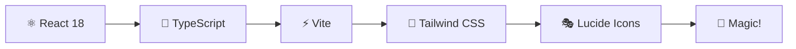

# 🌟 Virtual Photocard Cam ✨

> **🎯 魔法のようなフォトカード合成体験をあなたの手に！**

[](https://vphocam.izumiz.dev/)
[](https://reactjs.org/)
[](https://www.typescriptlang.org/)
[](https://tailwindcss.com/)
[](https://vitejs.dev/)

## 🚀 今すぐ体験！

**[🌈 https://vphocam.izumiz.dev/](https://vphocam.izumiz.dev/)** でいますぐ使えます！

---

## 🎨 これは何？

Virtual Photocard Camは、**K-POPフォトカード**と**お気に入りの背景**を組み合わせて、まるで**プロが撮影したような美しい写真**を作成できる革新的なWebアプリです！

### 🔥 なぜこのアプリが特別なの？

- 🎪 **リアルなビニールスリーブ効果** - 本物のフォトカードみたいな質感
- 📱 **完璧なモバイル体験** - スマホでサクサク操作
- 🌙 **美しいダークモード** - 目に優しい夜間作業
- ⚡ **爆速レスポンス** - 待ち時間ゼロの快適操作
- 🎯 **直感的UI** - 誰でもすぐに使える

## ✨ 魔法の機能たち

### 🖼️ 画像選択
- 📸 **背景画像**: ギャラリーから選択 or カメラで撮影
- 🎴 **フォトカード**: ワンタップでアップロード
- 📐 **アスペクト比**: 9:16, 3:4, 1:1, 4:3, 16:9 から選択

### 🎮 編集・調整
- 👆 **ドラッグ&ドロップ**: 自由自在な位置調整
- 🤏 **ピンチズーム**: 指先でサイズ調整（モバイル）
- 🎛️ **精密スライダー**: ミリ単位の調整（デスクトップ）
- 🎭 **リアル3D効果**: 角丸カード + ビニールスリーブ

### 📱 モバイル最適化
- 📲 **タッチ操作完全対応**
- 🔄 **レスポンシブデザイン**
- 🎯 **ヘッダーボタン配置** - 画面下でも押しやすい！

## 🛠️ 技術スタック



- **⚛️ React 18** - 最新のReact機能をフル活用
- **📝 TypeScript** - 型安全で開発効率UP
- **⚡ Vite** - 爆速ビルド & HMR
- **🎨 Tailwind CSS** - 美しいデザインを素早く
- **🎭 Lucide React** - 美麗アイコンセット

## 🎯 使い方（超簡単！）

### ステップ 1️⃣: 画像を選ぶ
```
📸 背景画像をアップロード
🎴 フォトカードをアップロード
📐 お好みのアスペクト比を選択
```

### ステップ 2️⃣: 魔法をかける
```
✨ 「合成」ボタンをタップ
🎪 瞬時に美しい合成画像が完成！
```

### ステップ 3️⃣: 完璧に仕上げる
```
👆 ドラッグで位置調整
🤏 ピンチでサイズ調整
🎯 完璧な構図を作成
```

### ステップ 4️⃣: 保存して共有
```
💾 「保存」ボタンでダウンロード
📱 SNSでシェア
🎉 みんなに自慢しよう！
```

## 🎮 操作のコツ

| 操作 | モバイル 📱 | デスクトップ 💻 |
|------|-------------|-----------------|
| **背景移動** | 👆 ドラッグ | 🖱️ ドラッグ |
| **カード移動** | 👆 ドラッグ | 🖱️ ドラッグ |
| **サイズ調整** | 🤏 ピンチ | 🎛️ スライダー |
| **プレビュー** | 👆 タップで拡大 | 🖱️ クリックで拡大 |

## 🔧 開発者向け

### 🚀 クイックスタート
```bash
# 📦 依存関係をインストール
npm install

# 🔥 開発サーバーを起動
npm run dev

# 🌟 ブラウザで http://localhost:5173 を開く
```

### 🏗️ ビルド
```bash
# 📦 プロダクション用ビルド
npm run build

# 👀 ビルド結果をプレビュー
npm run preview
```

### 🧪 型チェック
```bash
# 🔍 TypeScriptの型チェック
npm run type-check
```

## 🌟 スクリーンショット

*近日公開！美しいスクリーンショットを準備中...*

## 💡 今後の予定

- [ ] 🎨 フィルター機能
- [ ] 📷 複数フォトカード対応
- [ ] 🎭 フレーム機能
- [ ] 🌈 カラー調整
- [ ] 📊 使用統計
- [ ] 🔄 履歴機能

## 🤝 コントリビュート

プルリクエスト大歓迎！🎉 バグ報告や機能提案もお気軽にどうぞ！

## 📄 ライセンス

MIT License - 自由に使ってね！💖

---

<div align="center">

**🌟 気に入った？スターをつけてね！⭐**

Made with 💖 by [izumiz-dev](https://github.com/izumiz-dev)

[](https://github.com/izumiz-dev/virtual-photocard-cam)

</div>